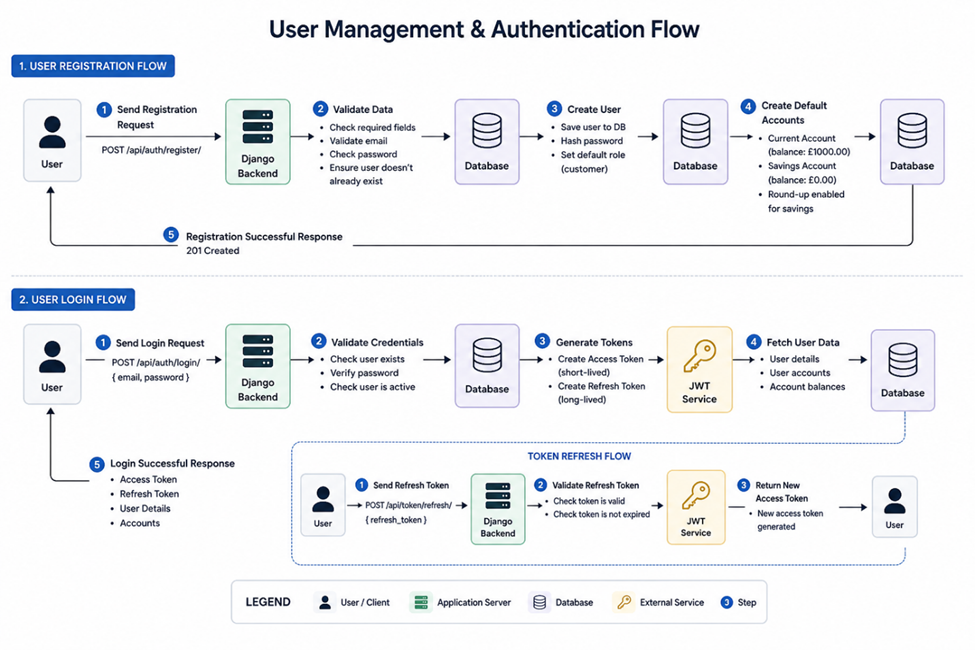

Feature 1: User Management & Authentication 
This feature handles how users create accounts, log in, and stay authenticated when using the app.
1. Registration 
When a user signs up, they send their details (e.g., email and password) to the backend API.
The backend:
•	validates the data (checks email format, password, duplicates) 
•	securely hashes the password (so it’s never stored as plain text) 
•	saves the user in the database 
•	automatically creates default bank accounts (current + savings) 
A success response is then returned to the user.

